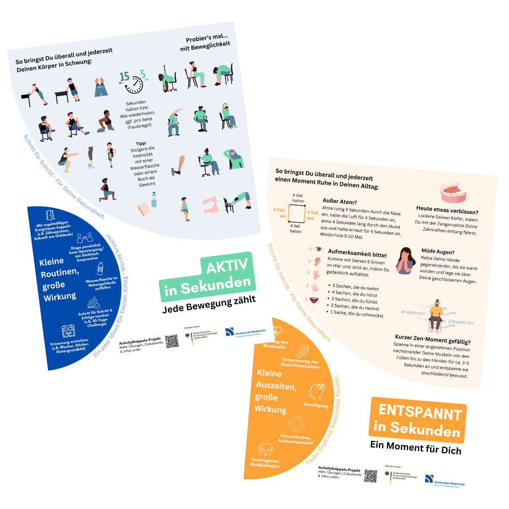
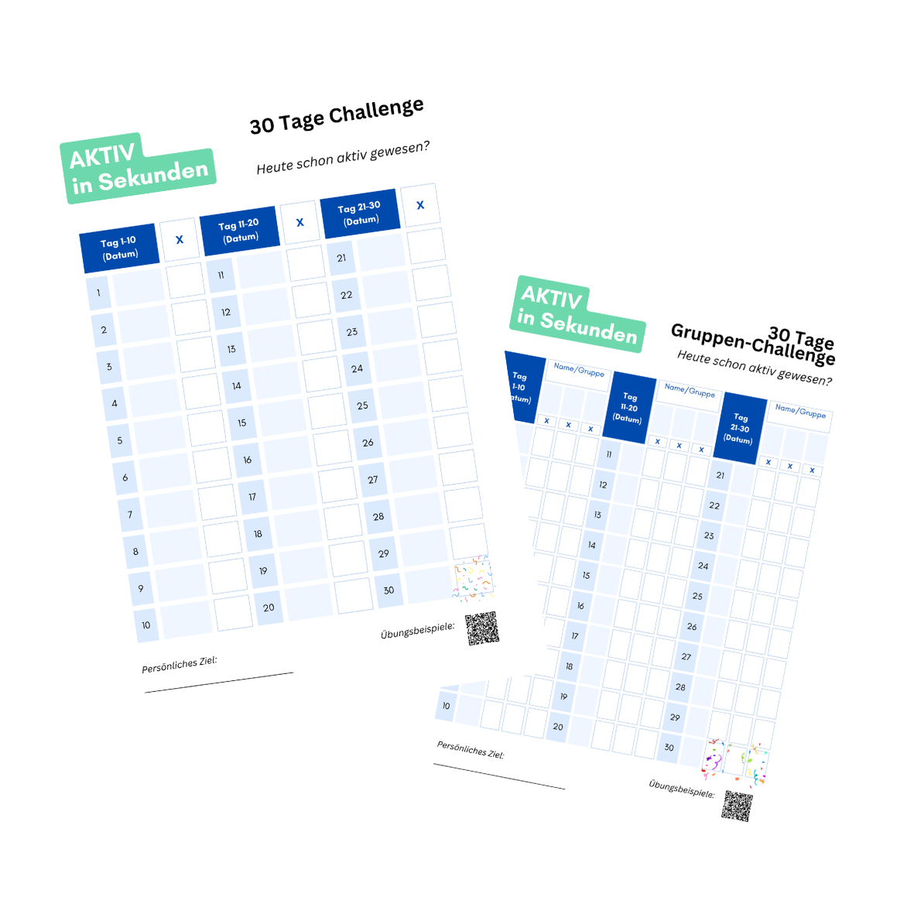
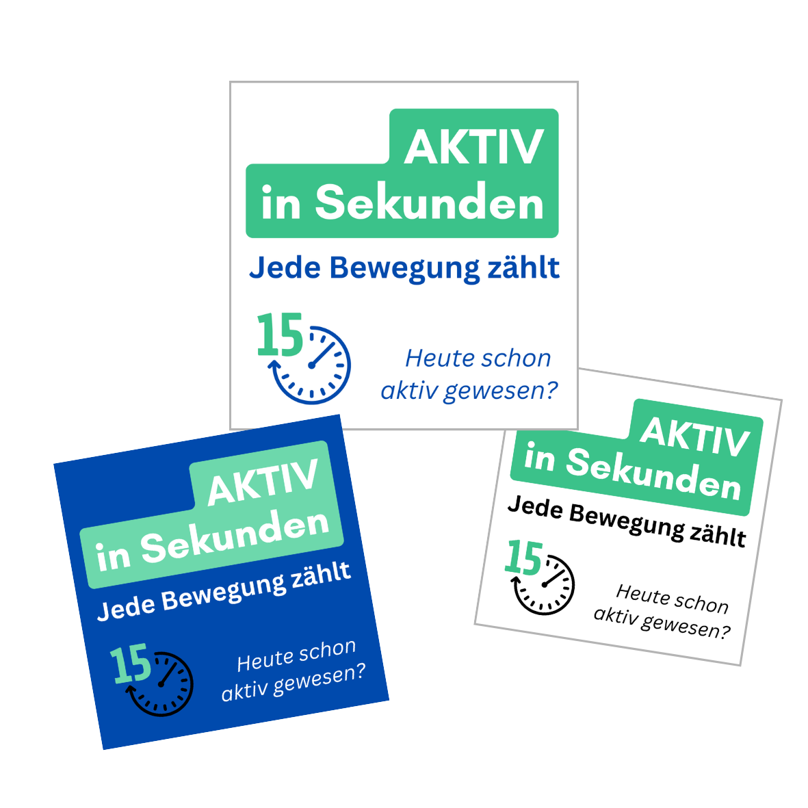
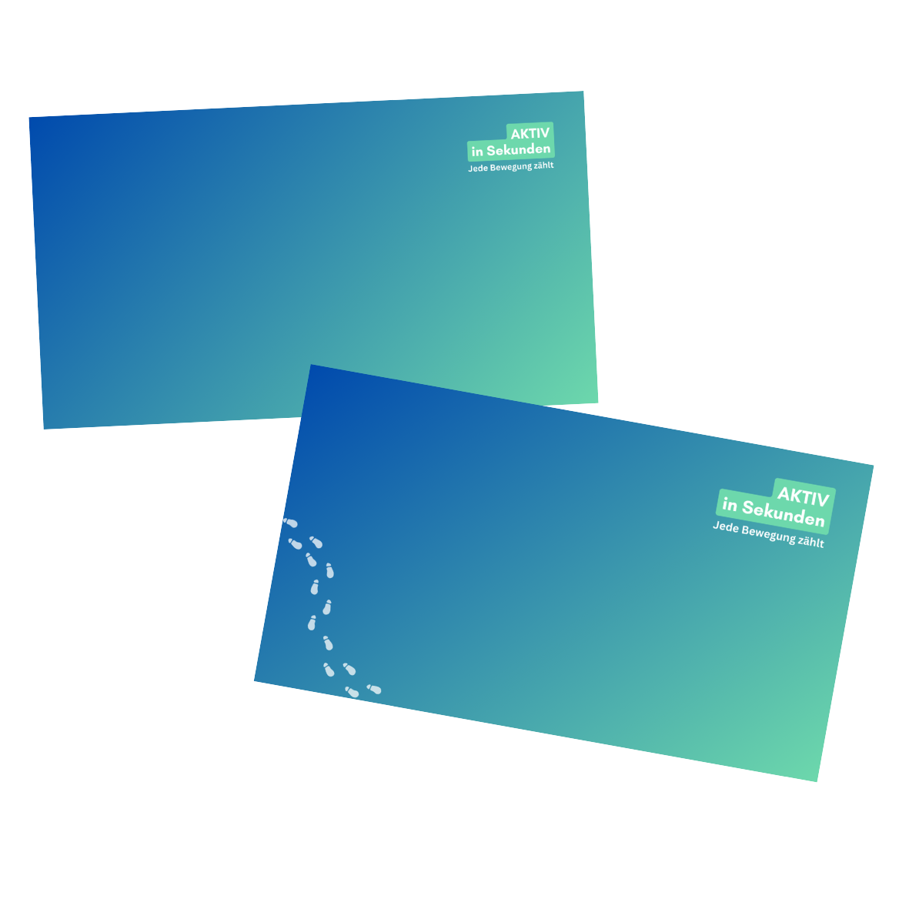

# Aktiv in Sekunden
Auf dieser Seite stehen einige kostenfreie Materialien zur Förderung von Aktivität, Beweglichkeit und Entspannung im Alltag zur Verfügung, die an der Hochschule Niederrhein im Rahmen des BMFTR-geförderten Projekts "ActivitySnippets" entwickelt wurden.

Unser Motto: *"Jede Bewegung zählt"*

Viel Spaß!

## Toolbox
Kurze Übungen mit Bildern und Textanleitungen.

<!-- Filtermöglichkeiten -->

  

    <strong style="font-size:14px;">Übungsart:</strong> 
    <button class="filter-btn" data-filter="uebungsart" data-value="alle" style="margin: 5px 5px 5px 0;padding:5px 10px; border-radius:5px; border:1px solid #007aad; background:white; color:#007aad; font-size:12px; cursor:pointer;">Alle</button>
    <button class="filter-btn" data-filter="uebungsart" data-value="aktivitaet" style="margin: 5px 5px 5px 0; padding:5px 10px; border-radius:5px; border:1px solid #007aad; background:white; color:#007aad; font-size:12px; cursor:pointer;">Aktivität</button>
    <button class="filter-btn" data-filter="uebungsart" data-value="beweglichkeit" style="margin: 5px 5px 5px 0;padding:5px 10px; border-radius:5px; border:1px solid #007aad; background:white; color:#007aad; font-size:12px; cursor:pointer;">Beweglichkeit</button>
    <button class="filter-btn" data-filter="uebungsart" data-value="entspannung" style="margin: 5px 5px 5px 0;padding:5px 10px; border-radius:5px; border:1px solid #007aad; background:white; color:#007aad; font-size:12px; cursor:pointer;">Entspannung</button>
  

  

    <strong style="font-size:14px;">Gegenstände:</strong> 
    <button class="filter-btn" data-filter="gegenstand" data-value="alle" style="margin: 5px 5px 5px 0;padding:5px 10px; border-radius:5px; border:1px solid #007aad; background:white; color:#007aad; font-size:12px; cursor:pointer;">Alle</button>
    <button class="filter-btn" data-filter="gegenstand" data-value="keine" style="margin: 5px 5px 5px 0;padding:5px 10px; border-radius:5px; border:1px solid #007aad; background:white; color:#007aad; font-size:12px; cursor:pointer;">Keine</button>
    <button class="filter-btn" data-filter="gegenstand" data-value="stuhl" style="margin: 5px 5px 5px 0;padding:5px 10px; border-radius:5px; border:1px solid #007aad; background:white; color:#007aad; font-size:12px; cursor:pointer;">Stuhl</button>
    <button class="filter-btn" data-filter="gegenstand" data-value="tisch" style="margin: 5px 5px 5px 0;padding:5px 10px; border-radius:5px; border:1px solid #007aad; background:white; color:#007aad; font-size:12px; cursor:pointer;">Tisch</button>
    <button class="filter-btn" data-filter="gegenstand" data-value="sonstige" style="margin: 5px 5px 5px 0;padding:5px 10px; border-radius:5px; border:1px solid #007aad; background:white; color:#007aad; font-size:12px; cursor:pointer;">Sonstige</button>
  

  

  <button id="reset-filters" style="padding: 5px 10px; background-color: #999; color: white; border: none; border-radius: 5px; cursor: pointer; font-size:13px;">
    Filter löschen
  </button>

<!-- Galerie -->

  

    <button id="prev-btn" style="padding: 10px 15px; background-color: #007aad; color: white; border: none; border-radius: 5px; cursor: pointer; font-size: 18px;">←</button>
    
    

      
      

    

    
    <button id="next-btn" style="padding: 10px 15px; background-color: #007aad; color: white; border: none; border-radius: 5px; cursor: pointer; font-size: 18px;">→</button>
  

  
  

    <button id="fullscreen-btn" style="padding: 8px 16px; background-color: #555; color: white; border: none; border-radius: 5px; cursor: pointer;">🔍 Vergrößern</button>
    
  

<!-- Vollbild-Modal -->

  
  <button id="close-fullscreen" style="position: absolute; top: 20px; right: 30px; background-color: white; color: black; border: none; padding: 10px 15px; font-size: 24px; cursor: pointer; border-radius: 5px;">✕</button>

<a href="assets/img/Toolbox.pdf" download="Toolbox.pdf">
  <button style="padding: 10px 20px; background-color: #007aad; color: white; border: none; border-radius: 5px; cursor: pointer; font-size: 16px;">
    Gesamte Toolbox (PDF) herunterladen
  </button>
</a>

## Poster
Vier Poster mit Übungsbeispielen und Ideen zur Ritualisierung im Alltag.

  

  <a href="assets/img/Poster_Aktiv_in_Sekunden.pdf" download="Poster_Aktiv_in_Sekunden.pdf">
    <button style="padding: 10px 20px; background-color: #007aad; color: white; border: none; border-radius: 5px; cursor: pointer; font-size: 16px;">
      zum PDF
    </button>
  </a>

## 30-Tage-Challenge
Challenge-Vorlagen, um Erfolge zu tracken und im Team mit- bzw. gegeinander anzutreten.

  

  <a href="assets/img/Aktiv_Challenge.pdf" download="Aktiv_Challenge.pdf">
    <button style="padding: 10px 20px; background-color: #007aad; color: white; border: none; border-radius: 5px; cursor: pointer; font-size: 16px;">
      zum PDF
    </button>
  </a>

## Sticker und Hintergrundbilder
Zur Erinnerung an aktive Sekunden.

  

  <a href="assets/img/Sticker_Aktiv_in_Sekunden.pdf" download="Sticker_Aktiv_in_Sekunden.pdf">
    <button style="padding: 10px 20px; background-color: #007aad; color: white; border: none; border-radius: 5px; cursor: pointer; font-size: 16px;">
      zum PDF
    </button>
  </a>

  

  <a href="assets/img/Hintergrundbilder.pdf" download="Hintergrundbilder.pdf">
    <button style="padding: 10px 20px; background-color: #007aad; color: white; border: none; border-radius: 5px; cursor: pointer; font-size: 16px;">
      zum PDF
    </button>
  </a>

# Kontakt
**ActivitySnippets-Team, Hochschule Niederrhein**

Vertr.Prof. Dr. sc. med. Lukas Streese-Schüler

Leonie Reimann

Christina Arnold

E-Mail: [activitysnippets@hs-niederrhein.de](mailto:activitysnippets@hs-niederrhein.de)

Hochschul-Webseite: [https://www.hs-niederrhein.de/gesundheitswesen/forschung/projekt-activity-snippets/](https://www.hs-niederrhein.de/gesundheitswesen/forschung/projekt-activity-snippets/)

Das Projekt wurde gefördert vom Bundesministerium für Forschung, Technologie und Raumfahrt (BMFTR).
